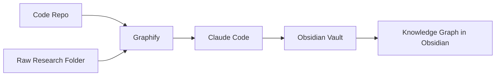

# Claude + Obsidian + Graphify Setup Guide

This guide gives you one clean architecture:

- **Code repos** stay code repos.
- **Obsidian** is the long term knowledge base.
- **Graphify** is the structure and retrieval layer for raw code and raw research.
- **Claude Code** is the worker that understands the repo, then writes useful notes into Obsidian.

Do **not** merge the code repo into the vault.
Do **not** let Claude write freely into the whole vault.
Do **not** start by pointing Graphify at your entire vault.

That path looks clever for two days and then turns into a markdown landfill.

---

## 1. What each piece does

### Obsidian
Obsidian is where durable notes live.
It stores plain Markdown files and links between them.

Use it for:
- project research notes
- decision notes
- session summaries
- reusable concepts
- snippets worth keeping

Do **not** use it as the place where your running code lives.

### Claude Code
Claude Code works in the repo.
It reads files, edits code, runs commands, and can call scripts.

Use it for:
- coding
- debugging
- understanding a repo
- saving structured knowledge into Obsidian

### Graphify
Graphify builds a knowledge graph from a folder of code, docs, papers, PDFs, screenshots, diagrams, audio, video, or mixed raw material.

Use it for:
- understanding a codebase faster
- understanding a messy research folder faster
- giving Claude structural context before raw file search

Do **not** treat Graphify as your final note system.
Graphify helps Claude understand.
Obsidian stores the curated result.

---

## 2. Final architecture



### Meaning
- Graphify maps raw material.
- Claude uses that map plus the actual files.
- Claude saves only the useful distilled knowledge into Obsidian.
- Obsidian links those notes into your long term knowledge graph.

---

## 3. What lives where

### Code repo
Your repo stays normal.

Example:

```text
my-app/
├── src/
├── tests/
├── docs/
├── .claude/
├── .graphifyignore
├── CLAUDE.md
└── graphify-out/
```

### Obsidian vault
Your vault stays a separate folder.

Example:

```text
KnowledgeVault/
├── 00 Inbox/
│   ├── AI Captures/
│   ├── Session Summaries/
│   └── To Process/
├── 01 Projects/
│   └── Project Alpha/
│       ├── Project Alpha.md
│       ├── Research/
│       ├── Decisions/
│       ├── Meetings/
│       ├── Snippets/
│       └── Scratch/
├── 02 Concepts/
├── 03 Sources/
├── 04 Dashboards/
├── 90 Templates/
├── 99 Archive/
├── .gitignore
└── CLAUDE.md
```

---

## 4. Files included in this starter kit

### In `home/.claude/`
- `CLAUDE.md`  
  Your personal cross-project Claude rules.

### In `vault/`
- `CLAUDE.md`  
  Your vault behavior rules.
- `.gitignore`
- `90 Templates/Research Note.md`
- `90 Templates/Decision Note.md`
- `90 Templates/Session Summary.md`
- `90 Templates/Snippet Note.md`

### In `repo/`
- `CLAUDE.md`  
  Repo instructions and Graphify workflow rules.
- `.graphifyignore`
- `.claude/obsidian-config.json`
- `.claude/settings.local.json`
- `.claude/scripts/save_note.py`
- `.claude/hooks/create_session_summary.py`

---

## 5. Before you start

You need:

- Obsidian installed
- Claude Code installed
- Python 3.10 or newer
- A real code repo
- A place on disk for your Obsidian vault

You will also later install Graphify inside the repo environment.

---

## 6. Create the Obsidian vault

### Step 1
Create a folder on disk for your vault.

Example:

```bash
mkdir -p ~/KnowledgeVault
```

### Step 2
Open Obsidian.

### Step 3
Choose **Open folder as vault** and select that folder.

### Step 4
Inside the vault, create these folders:

```text
00 Inbox/AI Captures
00 Inbox/Session Summaries
00 Inbox/To Process
01 Projects
02 Concepts
03 Sources
04 Dashboards
90 Templates
99 Archive
```

### Step 5
For each active project, create a project folder:

```text
01 Projects/Project Alpha
01 Projects/Project Alpha/Research
01 Projects/Project Alpha/Decisions
01 Projects/Project Alpha/Meetings
01 Projects/Project Alpha/Snippets
01 Projects/Project Alpha/Scratch
```

### Step 6
Create the project home note:

```text
01 Projects/Project Alpha/Project Alpha.md
```

Use a simple starter structure:

```md
---
type: project
status: active
---

# Project Alpha

## Purpose

## Current status

## Active questions

## Key decisions

## Research

## Session summaries
```

---

## 7. Put the included vault files in place

### Copy these files
- `vault/CLAUDE.md` → `<your-vault-root>/CLAUDE.md`
- `vault/.gitignore` → `<your-vault-root>/.gitignore`
- everything in `vault/90 Templates/` → `<your-vault-root>/90 Templates/`

### Then edit the templates
Replace:
- `__PROJECT_NAME__`
- `__PROJECT_SLUG__`

You can either:
- hardcode one project per template set
- or keep placeholders and use them manually when you save notes

---

## 8. Put the included general Claude file in place

Copy:

- `home/.claude/CLAUDE.md` → `~/.claude/CLAUDE.md`

If `~/.claude/` does not exist, create it first:

```bash
mkdir -p ~/.claude
```

This file is your global behavior layer.
It applies across projects.

---

## 9. Put the included repo files in place

In your real code repo, copy:

- `repo/CLAUDE.md` → `<your-repo>/CLAUDE.md`
- `repo/.graphifyignore` → `<your-repo>/.graphifyignore`
- `repo/.claude/obsidian-config.json` → `<your-repo>/.claude/obsidian-config.json`
- `repo/.claude/settings.local.json` → `<your-repo>/.claude/settings.local.json`
- `repo/.claude/scripts/save_note.py` → `<your-repo>/.claude/scripts/save_note.py`
- `repo/.claude/hooks/create_session_summary.py` → `<your-repo>/.claude/hooks/create_session_summary.py`

If `.claude/` does not exist inside the repo, create it:

```bash
mkdir -p <your-repo>/.claude/scripts
mkdir -p <your-repo>/.claude/hooks
```

---

## 10. Edit the two placeholders that matter most

Open:

`<your-repo>/.claude/obsidian-config.json`

Replace:
- `__VAULT_NAME__`
- `__PROJECT_NAME__`

Example:

```json
{
  "vault_name": "KnowledgeVault",
  "project_name": "Project Alpha",
  "folders": {
    "session_summaries": "00 Inbox/Session Summaries",
    "research": "01 Projects/Project Alpha/Research",
    "decisions": "01 Projects/Project Alpha/Decisions",
    "snippets": "01 Projects/Project Alpha/Snippets"
  },
  "daily_note_enabled": true
}
```

### What these values mean

#### `vault_name`
This is the vault name Obsidian uses.
Usually it is just the folder name of the vault.

#### `project_name`
This is the project name that will be written into note frontmatter and internal links.

#### `folders`
These are the destination folders inside the vault.
If they do not match your actual vault folders, the scripts will fail.

---

## 11. Enable Obsidian CLI

Open Obsidian.

Go to:

**Settings → General → Command line interface**

Enable it.

Important:
- The Obsidian app must be running when the scripts use the CLI.
- If the CLI is not enabled, your automation will fail.

### Test the CLI

In a terminal, run:

```bash
obsidian help
```

If that works, the CLI is visible on your machine.

---

## 12. Make the Python scripts executable

From your repo root:

```bash
chmod +x .claude/scripts/save_note.py
chmod +x .claude/hooks/create_session_summary.py
```

---

## 13. What the two Python scripts do

### `save_note.py`
This is the controlled write path from Claude into Obsidian.

It creates:
- research notes
- decision notes
- snippet notes

Claude should call this script instead of freelancing file creation logic every time.

### `create_session_summary.py`
This is the end-of-session hook.

When a Claude Code session ends, it creates:
- one session summary note in `00 Inbox/Session Summaries`
- optionally one line in today’s daily note if `daily_note_enabled` is `true`

---

## 14. Install Claude Code if needed

Use Anthropic’s official install method for your platform.
Then check:

```bash
claude --version
claude doctor
```

You can also run:

```text
/status
```

inside Claude Code to inspect active configuration.

---

## 15. Why there are multiple `CLAUDE.md` files

You should use three layers:

### Global
`~/.claude/CLAUDE.md`
- your personal defaults
- your general Obsidian behavior
- your preferred coding style

### Repo
`<your-repo>/CLAUDE.md`
- repo commands
- repo rules
- Graphify workflow
- how this repo maps into the vault

### Vault
`<your-vault-root>/CLAUDE.md`
- folder rules
- note rules
- linking rules
- graph-building rules for notes

### Important detail
If you run Claude from the repo and expose the vault as an added directory, enable this environment variable so Claude also loads the vault’s `CLAUDE.md`:

```bash
export CLAUDE_CODE_ADDITIONAL_DIRECTORIES_CLAUDE_MD=1
```

Add that to your shell profile if you want it permanent.

---

## 16. Give Claude access to the vault

There are two sane ways.

### Option A: Add the vault as an additional directory when you launch Claude
This is clean and keeps repo and vault separate.

### Option B: Use filesystem or tool access through your normal Claude Code workflow
This also works, but still keep writes limited to the approved folders.

What matters is not the exact launch style.
What matters is that:
- Claude can read the vault
- Claude writes only through the controlled paths and rules

---

## 17. Install Graphify in the repo

Inside the repo environment:

```bash
pip install graphifyy
graphify install
```

Then build the graph for the repo:

```bash
graphify .
```

This should create:

```text
graphify-out/
├── graph.html
├── GRAPH_REPORT.md
├── graph.json
└── cache/
```

### What these files are

#### `GRAPH_REPORT.md`
Human-readable summary of important nodes, communities, and relationships.

#### `graph.json`
The machine-readable graph for queries.

#### `graph.html`
Interactive graph visualization.

#### `cache/`
Incremental processing cache.

---

## 18. Tell Claude to use Graphify

In the repo, run:

```bash
graphify claude install
```

This adds Graphify’s always-on Claude integration for repo understanding.

### What that does
It tells Claude to check `graphify-out/GRAPH_REPORT.md` before broad raw-file searching for architecture questions.

### Important
Graphify is for understanding the repo and raw materials.
It does **not** replace the Obsidian vault.

---

## 19. Do not point Graphify at the whole vault yet

Use Graphify in these places first:

### Good
- the code repo
- a raw research folder full of PDFs, notes, screenshots, docs, diagrams

### Not good on day one
- your entire Obsidian vault

Why:
- your vault is already a curated layer
- Graphify is strongest on messy or large raw corpora
- you do not need a second graph layer on top of an unproven note workflow

---

## 20. Set up Git for the Obsidian vault

At the vault root:

```bash
git init
git branch -M main
```

Optional:

```bash
git remote add origin <your-private-repo-url>
```

### Why use Git for the vault
Use Git for:
- history
- rollback
- backup discipline
- reviewing Claude’s changes

Do **not** rely on Git alone for seamless multi-device sync unless you are comfortable managing conflicts.

---

## 21. Recommended sync model

Best overall:
- Obsidian Sync for device sync
- Git for backup and version history

Good enough:
- one file sync layer
- Git for backup/history

More manual:
- Git only

Do not mix several live sync layers on the same vault without understanding the conflict risk.

---

## 22. How the knowledge graph works in Obsidian

Obsidian’s graph is created by links like:

```md
[[Project Alpha]]
[[OAuth PKCE refresh flow]]
[[Use rotating refresh tokens]]
```

That is why the vault `CLAUDE.md` forces linking rules.

### The pattern you want
- project home note = hub
- research notes = link to project + sibling research
- decision notes = link to project + informing research
- session summaries = link to project + notes created that day
- concept notes = link across projects only when really reusable

This gives you a useful graph instead of spaghetti.

---

## 23. How Graphify and the Obsidian graph work together

They are different things.

### Graphify graph
This is a machine-readable structural graph of a repo or raw corpus.

### Obsidian graph
This is your human knowledge graph built from note links.

### Relationship
- Graphify helps Claude understand the source material.
- Claude distills useful findings into notes.
- Obsidian stores those notes and links them into your long-term graph.

So the flow is:

**repo or raw materials → Graphify → Claude understanding → Obsidian notes**

---

## 24. Test the system in this exact order

### Test 1: Obsidian CLI
Run:

```bash
obsidian help
```

If this fails:
- Obsidian is not running
- or CLI is not enabled
- or the CLI is not on your PATH

### Test 2: Save-note script
From the repo root:

```bash
printf '%s
' 'This is a smoke test.' | python3 .claude/scripts/save_note.py --type research --title "Smoke test note" --stdin-body
```

Expected result:
- a research note appears in the vault at the configured research folder

If this fails:
- check `obsidian-config.json`
- check the vault name
- check the destination folder paths
- check that Obsidian is open

### Test 3: Session summary hook
Start Claude in the repo, do something small, then exit the session.

Expected result:
- a note appears in `00 Inbox/Session Summaries/`
- the filename includes date and time so sessions do not overwrite each other

If this fails:
- use `/status`
- inspect `.claude/settings.local.json`
- run the hook manually with JSON piped to stdin

Example manual test:

```bash
echo '{"session_id":"test123","cwd":"'"$PWD"'","hook_event_name":"SessionEnd","reason":"other","transcript_path":"/tmp/fake.jsonl"}' | python3 .claude/hooks/create_session_summary.py
```

### Test 4: Graphify
Run:

```bash
graphify .
```

Expected result:
- `graphify-out/` appears
- `GRAPH_REPORT.md` exists

---

## 25. Daily workflow

### During coding
Claude works in the repo.
When something is worth keeping, tell Claude to save:
- a research note
- a decision note
- a snippet note

### During research
Put raw material in:
- the repo docs folder
- or a separate raw research folder

Use Graphify there when the material gets messy.

### End of session
Let the hook create the session summary automatically.

### Weekly
Open:
- `00 Inbox/AI Captures`
- `00 Inbox/Session Summaries`

Then:
- promote only the good notes
- merge duplicates
- connect notes with better links
- move truly durable ideas to `02 Concepts`

---

## 26. Prompts you can actually use

### Save a research note
> Save the important part of this as a research note in Obsidian titled "OAuth PKCE refresh flow". Use the local save script.

### Save a decision note
> Save this conclusion as a decision note in Obsidian titled "Use rotating refresh tokens". Use the local save script.

### Save a snippet
> Save this command pattern as a snippet note in Obsidian titled "pnpm workspace test command". Use the local save script.

### Use Graphify before raw searching
> Use Graphify first to understand the auth architecture, then inspect the most relevant files, then summarize the findings into one research note for Obsidian.

---

## 27. Common mistakes to avoid

### Mistake 1
Letting Claude write anywhere in the vault.

### Fix
Use the vault rules and keep writes limited to:
- Inbox
- project research
- project decisions
- project snippets
- project scratch

### Mistake 2
Treating Graphify as the long-term memory system.

### Fix
Graphify is the map.
Obsidian is the memory.

### Mistake 3
Auto-promoting raw notes to concepts.

### Fix
Keep `02 Concepts` human-curated.

### Mistake 4
No internal links.

### Fix
Every durable note needs a project link and at least one meaningful related link when possible.

### Mistake 5
Using the same note title with slight variants.

### Fix
Reuse canonical titles.

---

## 28. Troubleshooting

### Obsidian CLI command not found
- confirm CLI is enabled in Obsidian
- confirm Obsidian is running
- restart your shell
- check whether the CLI is on your PATH

### Notes not appearing in the vault
- check `obsidian-config.json`
- check exact folder names
- check the vault name
- keep Obsidian open while testing

### Hook not firing
- run `/status`
- check the JSON syntax in `.claude/settings.local.json`
- run the hook script manually
- make sure Python is available as `python3`

### Graphify works but Claude ignores it
- confirm `graphify-out/GRAPH_REPORT.md` exists
- run `graphify claude install`
- reopen Claude Code in the repo
- keep the repo `CLAUDE.md` rule that tells Claude to read the report first

### Too many junk notes
- tighten your prompts
- force use of the save script
- keep the vault `CLAUDE.md` strict
- do a weekly cleanup

---

## 29. Minimum viable setup if you want to start smaller

If you want the lean version, do only this first:

1. Obsidian vault with the folder structure
2. global `~/.claude/CLAUDE.md`
3. vault `CLAUDE.md`
4. repo `CLAUDE.md`
5. `obsidian-config.json`
6. `save_note.py`
7. `create_session_summary.py`
8. `settings.local.json`
9. Graphify on the repo only

That already gets you most of the value.

---

## 30. What you should edit first

In this order:

1. `repo/.claude/obsidian-config.json`
2. `repo/CLAUDE.md`
3. `vault/90 Templates/*.md`
4. `vault/CLAUDE.md` only if your folder names differ
5. `home/.claude/CLAUDE.md` if you want different global behavior

---

## 31. The one-sentence rule to remember

**Graphify helps Claude understand the source material, and Obsidian keeps the distilled knowledge.**

That is the architecture.

If you follow that rule, the whole setup stays sane.
